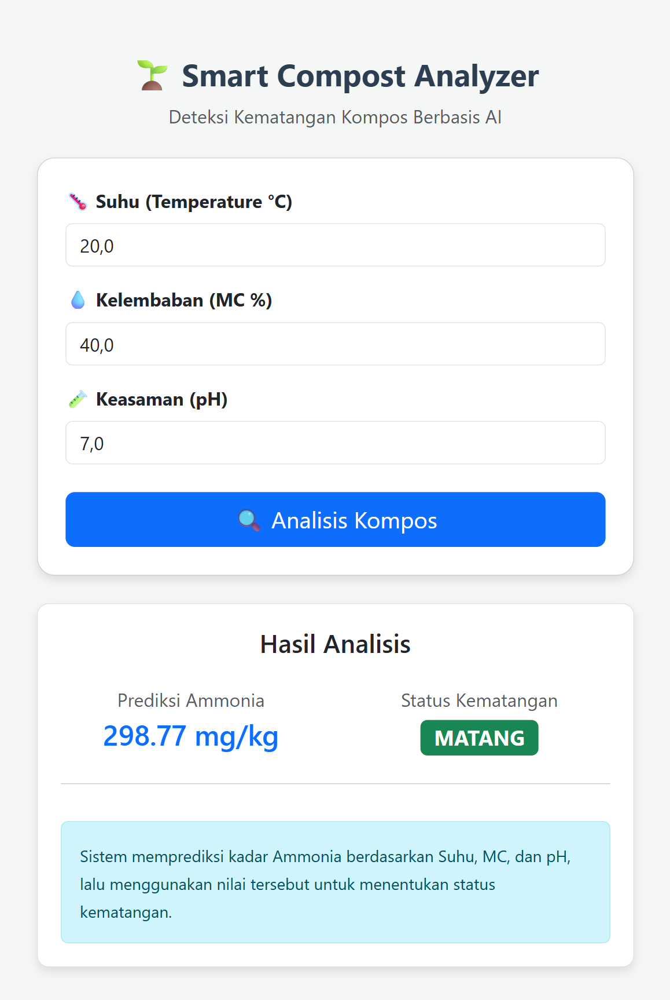

# 🌱 Model Prediksi Bertingkat (Two-Stage Prediction): Estimasi Kadar Amonia & Klasifikasi Status Kematangan Kompos


Proyek ini mengembangkan sistem **Machine Learning Bertingkat (Cascade System)** untuk memantau kualitas proses pengomposan.  
Pendekatan ini dirancang untuk mengatasi keterbatasan **sensor fisik Ammonia (mg/kg)** yang mahal, dengan memanfaatkan konsep **Virtual Sensor berbasis AI**.

---

## 📸 Tampilan Antarmuka



---

## 🚀 Gambaran Umum Sistem

Sistem bekerja melalui **dua tahap prediksi utama**:

1. **Tahap 1 – Virtual Sensor Ammonia**  
   Memprediksi kadar **Ammonia (mg/kg)** berdasarkan data sensor murah:
   - Suhu
   - Kelembaban / Moisture Content (MC)
   - pH

2. **Tahap 2 – Klasifikasi Kematangan Kompos**  
   Menentukan status kematangan kompos:
   - **Mentah**
   - **Setengah Matang**
   - **Matang**

   dengan menggunakan:
   - Data sensor fisik (Suhu, MC, pH)
   - Hasil prediksi Amonia dari Tahap 1

---

## 🔁 Alur Kerja (Prediction Pipeline)

```mermaid
graph LR
    A[Input Sensor] -->|Suhu, MC, pH| B(Model 1: Estimasi Amonia)
    B -->|Output: Amonia mg/kg| C{Input Gabungan}
    A --> C
    C -->|Suhu, MC, pH, Amonia| D(Model 2: Klasifikasi Kematangan)
    D -->|Output| E[Status: MATANG / SETENGAH MATANG / MENTAH]
